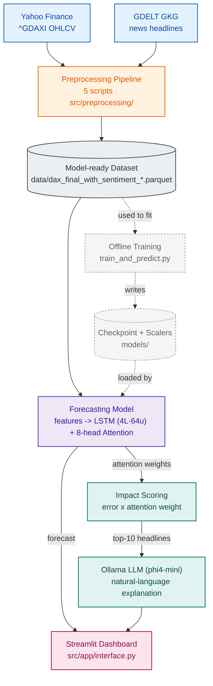

# Human-Centered Multi-Modal Forecasting of the German DAX

An explainable next-day forecasting system for the German DAX index that
combines price/technical data with news sentiment (GDELT headlines), built
around an LSTM + multi-head attention network with a natural-language
explanation layer.

## What this system does

1. **Price data** — DAX (`^GDAXI`) OHLCV data pulled from Yahoo Finance.
2. **News sentiment** — headlines about DAX-listed companies are pulled from
   the GDELT Global Knowledge Graph, matched to tickers, and scored for
   sentiment. The shipped dataset already includes per-headline sentiment
   scores for inference.
3. **Forecasting model** — a 4-layer LSTM (64 hidden units) followed by
   8-head multi-head attention, trained on 30-trading-day windows of 15
   technical indicators plus 2 daily-aggregated sentiment features (17
   features total) to predict the next day's adjusted close.
4. **Explainability** — for the most recent 30-day window, each headline is
   scored with an Impact Score (prediction error × mean attention weight),
   and the top-10 highest-impact headlines are passed to a local LLM (via
   [Ollama](https://ollama.ai), `phi4-mini`) to generate a natural-language
   explanation of the forecast.
5. **Delivery** — a Streamlit dashboard (`src/app/interface.py`) shows the
   next-day forecast, a candlestick chart, and the ranked headlines with
   their explanation.

## Architecture



The dashed branch on the left is the *offline* training path — it produces
the checkpoint the model loads, but is not part of a normal inference
request. Everything else is the live path: two public data sources feed
the preprocessing pipeline (5 scripts, detailed under "Regenerate the
datasets from raw sources" below), which writes a model-ready dataset;
the app reads that dataset, engineers features, runs the forecasting
model, and — in parallel — turns its attention weights into a ranked,
LLM-explained list of headlines, both of which land on the dashboard.

The pipeline and the app are decoupled by the dataset files in `data/`:
the five preprocessing scripts only ever need to run again to produce a
*new* `dax_final_with_sentiment_*.parquet` (e.g. to extend the shipped data
with more recent days — see "Updating to the latest data" below); day to
day, the Streamlit app and the smoke test just read whatever is currently
at those paths and never invoke the pipeline themselves. Training
(`train_and_predict.py`) is likewise a separate, manually-run step that
consumes the same kind of dataset and produces the checkpoint + scalers the
app loads — it is not part of the inference request path.

## Repository structure

```
├── data/                    # Datasets (see "Data" section below)
├── models/                  # Trained model weights + fitted scalers
├── notebooks/               # Exploratory analysis
├── src/
│   ├── app/                 # Streamlit dashboard + inference/explainability
│   │   ├── interface.py
│   │   ├── prediction_utils.py
│   │   └── setup_ollama.py
│   ├── training/
│   │   └── train_and_predict.py   # Model definition + training loop
│   └── preprocessing/        # Raw-data → model-ready-data pipeline
│       ├── pipeline_config.py       # Shared date-range/path config for the pipeline
│       ├── financial_data.py
│       ├── download_gdelt_gkg.py
│       ├── process_gdelt_leads.py
│       ├── prepare_headlines_for_sentiment.py
│       ├── preprocess.py
│       └── get_input_for_prediction.py   # Orchestrates the 5 scripts above
├── tests/
│   └── test_prediction.py    # End-to-end smoke test (load → predict → explain)
├── requirements.txt
└── .gitignore
```

## Setup

Requires **Python 3.10+**.

```bash
git clone https://github.com/AbS2693/Human-centered-multimodal-forecasting-of-the-German-DAX.git
cd Human-centered-multimodal-forecasting-of-the-German-DAX
python -m venv .venv
source .venv/bin/activate        # Windows: .venv\Scripts\activate
pip install -r requirements.txt
```

`torch` in `requirements.txt` installs a default build from PyPI. If you want
a CUDA build for GPU training, install it separately first following the
instructions at https://pytorch.org/get-started/locally/, then run
`pip install -r requirements.txt` (pip will skip torch since it's already
satisfied).

## Data

The repo ships with the datasets needed to run inference and the smoke test
out of the box:

- `data/dax_final_with_sentiment_granular.parquet` — one row per (trading
  day, headline) pair: OHLCV + per-headline sentiment scores. This is what
  `src/app/interface.py` and `tests/test_prediction.py` load; the daily
  technical + aggregated-sentiment features are reconstructed from it at
  runtime.
- `data/dax_index_data_20231201_20250528.{csv,parquet}` and
  `data/dax_index_data_20230530_20250528.{csv,parquet}` — plain OHLCV price
  history used at various points in the preprocessing/training pipeline.

`models/` ships the trained checkpoint (`best_dax_model_final.pth`) and the
two fitted `MinMaxScaler` objects (`scaler_features.gz`, `scaler_target.gz`)
fit during training and loaded at inference time so predictions use the
same scale the model was trained on.

You do not need to download or regenerate anything to run inference — the
files above are already in the repo and are exactly what
`src/app/interface.py` and `tests/test_prediction.py` load. Downloading and
rebuilding the raw data from scratch is only needed if you want to extend
the dataset (e.g. add more recent days) or reproduce how the shipped data
was made; see "Regenerate the datasets from raw sources" below.

## Running the project

### 1. Smoke test (recommended first step)

Verifies the full load → predict → explain pipeline runs correctly against
the shipped data and model:

```bash
python tests/test_prediction.py
```

If [Ollama](https://ollama.ai) isn't installed/running locally, the final
explanation step prints a message instead of failing — that's expected (see
"Enabling AI explanations" below), not an error. This uses only the data
already shipped in the repo and typically completes in under 30 seconds
once dependencies are installed.

### 2. Run the dashboard

```bash
streamlit run src/app/interface.py
```

This loads the shipped data and model, generates the next-day forecast, and
serves the interactive dashboard. On first run it also caches ~26 business
days of DAX price data (fetched live from Yahoo Finance) to
`src/app/dax_data.csv` for the candlestick chart.

### 3. Retrain the model

```bash
python src/training/train_and_predict.py
```

This retrains from `data/dax_index_data_20231201_20250528.parquet` plus a
news file expected at
`data/raw/processed_gdelt_leads/dax40_prepared_headlines_for_sentiment.parquet`.
That news file is an intermediate output of the preprocessing pipeline
(below) and isn't shipped in the repo due to its size — run the pipeline
first to produce it. Training also downloads `ProsusAI/finbert` from
Hugging Face on first run.

### 4. (Optional) Regenerate the datasets from raw sources

The raw → model-ready pipeline lives in `src/preprocessing/` and can be run
from any directory. It accepts a configurable date range instead of a fixed
window:

```bash
python src/preprocessing/get_input_for_prediction.py                        # default: last 90 days
python src/preprocessing/get_input_for_prediction.py --days-back 60         # last 60 days
python src/preprocessing/get_input_for_prediction.py --start-date 2026-06-01 --end-date 2026-06-30
```

The 90-day default isn't arbitrary: the model needs a full 30-*trading*-day
sequence, but building each row first consumes ~13 trading days of
rolling-window feature warm-up (RSI-14 is the binding one), putting the
practical floor at ~44 trading days before even one sequence can be
produced at all. 90 calendar days leaves a comfortable margin above that
floor so a default run reliably produces usable output — see "Updating to
the latest data" below for the full numbers and what happens if you go
lower.

This orchestrates 5 scripts in sequence. All raw/intermediate output goes
into `data/raw/`; the final output goes into `data/` itself, alongside the
shipped files:

| Step | Script | Reads | Writes |
|---|---|---|---|
| 1 | `financial_data.py` | Yahoo Finance (`^GDAXI`) for the chosen date range | `data/raw/dax_index_data_<start>_<end>.{csv,parquet}` |
| 2 | `download_gdelt_gkg.py` | `data.gdeltproject.org` GKG dumps (every 2h), same date range | `data/raw/gdelt_gkg_data/*.gkg.csv.zip` |
| 3 | `process_gdelt_leads.py` | the zips from step 2 | `data/raw/processed_gdelt_leads/dax40_gdelt_article_leads.parquet` |
| 4 | `prepare_headlines_for_sentiment.py` | step 3's output | `data/raw/processed_gdelt_leads/dax40_prepared_headlines_for_sentiment.parquet` |
| 5 | `preprocess.py` | steps 1 + 4's output | `data/dax_final_with_sentiment_{granular,aggregated_mean,aggregated_weighted,aggregated_max_impact}.parquet` |

No API key is needed — GDELT's GKG exports are public files, and Yahoo
Finance access is via `yfinance`. `preprocess.py` downloads the
`nlptown/bert-base-multilingual-uncased-sentiment` model from Hugging Face
on first run to score headline sentiment.

All stages within a single pipeline run share the same date range
automatically: if you only pass `--days-back`/`--start-date`/`--end-date` to
`get_input_for_prediction.py`, the value resolved by step 1 is recorded in
`data/raw/pipeline_manifest.json` and reused by the later stages, so price
data and news data always stay aligned to the same window. `preprocess.py`
also reads that manifest to pick up step 1's freshly-fetched price file and
step 4's freshly-prepared headlines automatically, rather than defaulting
to the shipped historical dataset.

Each stage prints when it starts and finishes, and `get_input_for_prediction.py`
prints a timing summary at the end. Expect the two network-bound stages
(GDELT download and sentiment scoring) to dominate the runtime — roughly,
for the 90-day default:

| Stage | Approximate duration for a 90-day window |
|---|---|
| 1. Price fetch | seconds |
| 2. GDELT download (~1,080 file requests: 12/day × 90 days) | 35–90 min, connection-dependent |
| 3. Extract leads | 15–60 min, dataset-size-dependent |
| 4. Clean headlines | under a minute |
| 5. Sentiment scoring | tens of minutes for the resulting headline volume on CPU |

Runtime scales roughly linearly with `--days-back`, since steps 2, 3 and 5
each do work proportional to the number of days/headlines requested.

Sentiment scoring computes each unique headline's score once and reuses it
across the granular dataset and all three aggregated variants, rather than
re-scoring the same headlines separately for each output.

#### Updating to the latest data

The shipped datasets (`data/dax_final_with_sentiment_*.parquet`) stop in
**late May 2025**. To bring them up to date, run the pipeline above with no
arguments — it defaults to fetching the most recent 90 calendar days from
today, from the same two public sources described above (Yahoo Finance for
price, GDELT for news), and writes output in the exact format and filenames
`src/app/interface.py` and `tests/test_prediction.py` already expect. No
code changes are needed to make freshly-downloaded data "compatible" — it
is compatible by construction, because it's produced by the same pipeline
that made the shipped data.

Two things worth knowing before you run it:

- **Why 90 days, not fewer.** The model needs a full 30-trading-day
  sequence, but the feature engineering that builds each row first consumes
  roughly 13 trading days computing rolling-window indicators (RSI-14 is
  the binding one — it can't produce a value until it has seen 14 prior
  days, and a few other indicators need a handful more). So the practical
  minimum is about 44 trading days (~62–65 calendar days including weekends
  and holidays) just to produce a *single* predictable sequence. Testing
  this directly confirms it: fetching only the original default of 26
  calendar days of price history produces **zero** usable sequences after
  feature engineering, and even 40 days still produces zero — the count
  only turns positive at 44 trading days. `--days-back` now defaults to 90
  calendar days to leave a comfortable safety margin above that minimum;
  passing a smaller value (e.g. `--days-back 30`) will run without error
  but can silently yield a dataset with no usable rows for inference.
- **It overwrites, not appends.** Step 5 writes to the same filenames the
  shipped datasets use (`data/dax_final_with_sentiment_granular.parquet`
  and the three aggregated variants), so a fresh run replaces the shipped
  ~18-month history with just the newly-fetched window rather than
  extending it. If you want to keep the original shipped data around for
  comparison, copy those four files elsewhere before running the pipeline.

Once the new files are written, `streamlit run src/app/interface.py` and
`python tests/test_prediction.py` will pick them up automatically on their
next run — both simply load whatever is at those same paths.

### 5. Enabling AI explanations (optional)

The natural-language explanation step calls a local Ollama server:

```bash
ollama serve
ollama pull phi4-mini
```

`src/app/setup_ollama.py` automates this on Windows only (it looks for
`ollama.exe` under `%LOCALAPPDATA%`); on macOS/Linux, install Ollama and run
the two commands above manually. Without Ollama running, the app and tests
still work — the explanation field just returns a message saying the
explanation couldn't be generated.

## Known limitations

- **Small dataset**: the shipped price history covers roughly a year and a
  half of trading days, which is a modest amount of data for training an
  LSTM from scratch — expect the model's forecasts to be directionally
  interesting rather than highly accurate.
- **Full retraining from raw sources isn't a single command**: as noted
  above, `train_and_predict.py` depends on an intermediate news file that
  only exists after running the preprocessing pipeline, which itself
  depends on live GDELT/Yahoo Finance access.
- **Sentiment model differs between preprocessing and training**:
  `preprocess.py` scores headlines with
  `nlptown/bert-base-multilingual-uncased-sentiment`, while
  `src/training/train_and_predict.py` uses `ProsusAI/finbert`. If
  regenerating data specifically to retrain the model, consider aligning
  the two.
